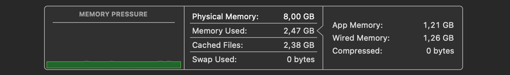

# Facet4 macOS Optimization and Debloat Script

**Author**: Hermann Heringer  
**Version**: 0.5  
**Repository**: [GitHub](https://github.com/hermannheringer/)


---

The **Facet4 macOS Optimization and Debloat Script** is a tool designed to enhance macOS performance through systematic adjustments to system services, UI settings, and network configurations. It is ideal for users seeking to reduce memory and CPU usage, streamline background processes, and optimize system responsiveness. 

When it comes to **daemons and services**, I've made extensive efforts to optimize or disable them, particularly those associated with analytics, performance monitoring, logging, crash reporting, and similar tasks. Believe me, it's not worth your time; you might end up damaging your system! The developers of the OS know what they’re doing. That's why I removed all the relevant elements from the code.


Nice!!!


> **Warning**: This script modifies core system configurations and should only be used by advanced users familiar with macOS internals. **Ensure a complete system backup** before proceeding.

---

## Table of Contents

1. [Prerequisites](#prerequisites)
2. [Features](#features)
3. [Usage Instructions](#usage-instructions)
4. [Reverting Changes](#reverting-changes)
5. [Compatibility](#compatibility)
6. [Disclaimer](#disclaimer)

---

## Prerequisites

1. **Disable System Integrity Protection (SIP)**:
   - Boot into Recovery Mode (`Command (⌘) + R`) for Intel-based Macs or press and hold the **Power** button until "Loading Startup Options" appears for M-based Macs.
   - Open **Terminal** and run: `csrutil disable`.
   - Restart into macOS with: `sudo reboot now`.

2. **Enable Root User**:
   - Go to **System Preferences** > **Users & Groups**.
   - In **Login Options**, select **Join** next to **Network Account Server**.
   - In **Directory Utility**, enable **Root User** and set a password.
   - Switch to root in Terminal: `su root`.

3. **Set Execution Permissions**:
   - Run `chmod +x facet4.sh` to make the script executable.

4. **Run the Script as Root**:
   - Execute the script using: `sudo ./facet4.sh`.
   - You can either copy, paste, or execute the instructions of your choice in the Terminal.
---

## Features

### 1. Performance Mode (Intel-Based Macs)
   - **Objective**: Enables macOS performance mode for Intel-based systems, enhancing CPU responsiveness.
   - **Commands**: `nvram boot-args="serverperfmode=1"`
   - **Verification**: Confirms through `nvram boot-args` for active setting.

### 2. Application Nap Deactivation
   - **Objective**: Disables Application Nap to prevent throttling of background applications, ensuring consistent multitasking performance.
   - **Commands**: `sudo defaults write -g NSAppSleepDisabled -bool true`
   - **Verification**: Confirms value with `defaults read`.

### 3. Spotlight Indexing and Metadata Optimization
   - **Objective**: Disables Spotlight indexing to reduce disk I/O, especially beneficial for systems with intensive disk usage.
   - **Commands**:
     - Disable: `mdutil -a -i off` | `mdutil -a -d`
     - Reset Index: `mdutil -a -E`

### 4. UI Performance Enhancements (Reduce Motion and Transparency)
   - **Objective**: Reduces visual effects for improved system performance, especially on older hardware.
   - **Commands**: Uses `defaults write` to disable window animations, reduce transparency, and enable accessibility optimizations.
   - **Verification**: Confirms through `defaults read` values for animation and transparency settings.

### 5. Feedback Assistant Deactivation
   - **Objective**: Disables Feedback Assistant to conserve system resources.
   - **Commands**: `defaults write com.apple.feedbackassistant showFeedbackAssistant -bool false`

### 6. Time Machine Auto-Backup Control
   - **Objective**: Stops automatic Time Machine backups to prevent unintended disk activity during active use.
   - **Commands**: `tmutil disable`

### 7. Siri and Voice Service Deactivation
   - **Objective**: Disables Siri and related services to reduce background processing.
   - **Commands**: Configures `defaults write` settings to disable Siri.

### 8. Telemetry and Tracking Block
   - **Objective**: Blocks common telemetry and tracking domains, enhancing user privacy by modifying the `/etc/hosts` file.
   - **Domains Blocked**: Microsoft, Apple, Google Analytics, Facebook, and other tracking providers.
   - **Verification**: Ensures all domains are appended to the hosts file, blocking outgoing data requests.

### 9. Additional System Optimizations
   - **Disable Sudden Motion Sensor** (SSD systems): `pmset -a sms 0
   - **Reset LaunchServices Database**: Rebuilds app association database to reduce load times on older systems.

---

**OneDrive Client for macOS 12.x Monterey EOL Workaround**

Microsoft is forcing users to upgrade their Apple hardware by automatically updating the OneDrive client to an incompatible version.

Here’s a temporary workaround:

1. Remove the incompatible OneDrive.app from the Applications folder.
2. Download and install the latest compatible version of the OneDrive client for Monterey (v24.101.0519.0010) from https://oneclient.sfx.ms/Mac/Installers/24.101.0519.0010/universal/OneDrive.pkg.
3. Block future updates by adding this line to your /etc/hosts file:

   ```
   127.0.0.1 oneclient.sfx.ms
   ```

This should keep OneDrive working until further notice. To aggressively remove the non-working app, use the Terminal command:

```
killall OneDrive

rm -rf "/Applications/OneDrive.app"

rm -rf ~/Library/Application\ Support/OneDrive
rm -rf ~/Library/Caches/com.microsoft.OneDrive
rm -rf ~/Library/Preferences/com.microsoft.OneDrive.plist

rm -rf ~/Library/Containers/com.microsoft.OneDrive*

sudo rm -rf /Library/Preferences/com.microsoft.OneDrive.plist

sudo rm -rf /var/db/receipts/com.microsoft.OneDrive*
sudo rm -rf /Library/Logs/Microsoft/OneDrive

```


---
## Usage Instructions

1. **Run the Script**:
   - Execute the script as root using: `sudo ./facet4.sh`.

2. **Restart the System**:
   - For optimal results, restart the system after running the script to ensure all changes take effect.

3. **Review Changes**:
    - If you are familiar with what you're doing, you might want to download and run `ONYX`(make sure to select the correct version for your macOS). `ONYX` is a multifunctional utility for macOS that allows you to verify the startup disk and the structure of its system files. It can also help you perform cleaning and maintenance tasks, configure hidden parameters for various Apple applications, and much more.

    - Don't waste your valuable time downloading and testing software, and avoid potential malware. Don't fall into this trap; the only tool I recommend is `ONYX`.

    https://www.titanium-software.fr/en/onyx.html


---

## Reverting Changes

Most settings can be reverted by adjusting the values in `defaults write` commands.

> Note: Some configurations may reset during macOS updates, which could necessitate reapplying specific settings.

---

## Compatibility

This script is tailored for macOS versions prior to Ventura (macOS 13), where certain services like Dashboard and various system daemons are accessible. Some commands may not be fully compatible with newer macOS releases, and behavior may vary across system versions.

---

## Disclaimer

This script is provided “as is” without warranty. By using this script, you assume all responsibility for any modifications it makes to your system. For further details on macOS configurations, consult Apple’s [official documentation](https://support.apple.com/).

---

For more detailed technical insights, visit [Apple’s macOS documentation](https://support.apple.com/).

---

Have fun!
